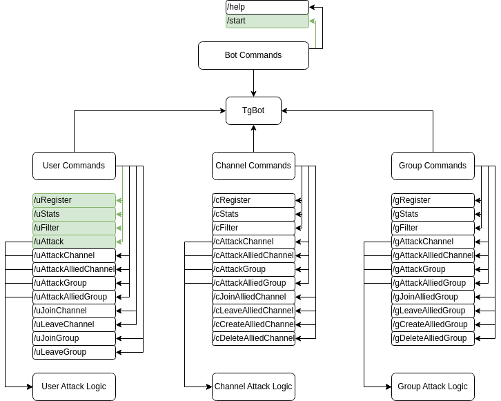

# Issue Tracker: Project Sage0x0

  

#### TODO
- [ ] Bot Commands
  - [x] Start
    - [x] Handler
    - [ ] Update `reply` Message
  - [ ] Help
- [ ] User Commands
  - [x] uRegister
    - [x] Handler
    - [ ] Update `reply` Message
  - [x] uStats
    - [x] Handler
    - [ ] Update `reply` Message
  - [ ] uFilter
    - [ ] Handler
  - [x] uAttack
    - [x] Handler
    - [x] Attack User
    - [x] Skip Attack User
    - [ ] Update `reply` Message
    - [ ] Remove Callback before attack
    - [ ] Replace Callback for next attack
  - [ ] uAttackChannel
  - [ ] uAttackAlliedChannel
  - [ ] uAttackGroup
  - [ ] uAttackAlliedGroup
- [ ] Channel Commands
  - [ ] cRegister
  - [ ] cStats
  - [ ] cFilter
  - [ ] cAttackChannel
  - [ ] cAttackAlliedChannel
  - [ ] cAttackGroup
  - [ ] cAttackAlliedGroup
- [ ] Group Commands
  - [ ] gRegister
  - [ ] gStats
  - [ ] gFilter
  - [ ] gAttackChannel
  - [ ] gAttackAlliedChannel
  - [ ] gAttackGroup
  - [ ] gAttackAlliedGroup
